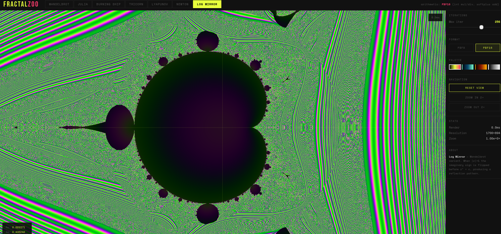

# lnscpp

Logarithmic number system (LNS) arithmetic in C++.

In an LNS, each number is stored as `(sign, log₂|x|)`:

- **Mul / div**: add / subtract the log fields — a single integer adder
  of width `n_bits`.
- **Add / sub**: Gauss log identity. For `|a| ≥ |b|`,
  `log(a ± b) = log|a| + f(log|a| − log|b|)` where `f = sb` for
  same-sign addition and `f = db` for opposite-sign.

Traditional LNS implementations store `sb` and `db` as ROMs. **PBF is
the table-free variant**: both functions are evaluated exactly in Q32
fixed-point by a closed-form continued fraction — no lookup table and no
approximation beyond the Q32 rounding itself. Because the same Q32 CF
engine handles every bit width, the format is parameterizable at
runtime: PBF4, PBF8, PBF16, and any custom
`pbf_init(&p, n_bits, v_min, v_max)` share one engine.

Trade-off vs float: you replace the mantissa multiplier with an integer
adder, at the cost of lower per-bit precision (PBF8 ≈ 4.6 bits, PBF16
≈ 11.7 bits) and a fixed-depth CF evaluation for add/sub.

This repo contains:

- **PBF** — Parameterized Bounded Format. Pure integer ALU, bounded
  magnitude range, continued-fraction `sb`/`db` primitives. Scalar in
  `pbf.cpp`, batch in `pbf_batch.cpp`, WebGL demo in `fractal_zoo.html`.
- **xlns32** — 32-bit LNS from the `xlnsresearch/xlnscpp` project.
  Included unchanged as a reference and test target; PBF does not depend
  on it.

`pbf.py` is the Python reference used for the C++ port.

---

## Quickstart

```cpp
// hello.cpp — compile:  g++ -std=c++11 -O2 hello.cpp -lm
#include "pbf.cpp"
#include <cstdio>

int main() {
    pbf_t p;
    pbf16_init(&p);                          // 16-bit, v_min=1e-8, v_max=1e8

    uint32_t a = pbf_encode(&p, 3.14);
    uint32_t b = pbf_encode(&p, 2.0);
    uint32_t c = pbf_mul(&p, a, b);          // integer add on log levels
    uint32_t d = pbf_add(&p, c, pbf_encode(&p, 1.0));

    printf("3.14 * 2.0 + 1.0 = %f\n", pbf_decode(&p, d));
    return 0;
}
```

---

## When to use which preset

| Preset      | Bits | Range          | Effective precision | Typical use                                |
|-------------|------|----------------|---------------------|--------------------------------------------|
| `pbf4_init` | 4    | 0.1 … 10       | ~2 bits             | demos, didactic examples                   |
| `pbf8_init` | 8    | 10⁻⁴ … 10⁴     | ~4.6 bits           | aggressive NN weight/activation quantization |
| `pbf16_init`| 16   | 10⁻⁸ … 10⁸     | ~11.7 bits          | drop-in for bfloat16-level precision work  |

Custom ranges with `pbf_init(&p, n_bits, v_min, v_max)` for other bit
widths.

---

## Requirements

- C++11 compiler with `__int128` (gcc or clang on x86-64 / ARM64,
  Linux / macOS / WSL). MSVC does **not** support `__int128` — on
  Windows use gcc under WSL or MSYS2.
- `make`, `libm`.

---

## Build

```bash
make          # build everything (PBF + xlns32)
make pbf      # PBF only
make xlns32   # xlns32 only
make run      # build and run the PBF demo + shim test
make clean    # remove build/
```

All binaries land in `build/`. To run a single test:

```bash
build/pbftest           # SNR + CF-accuracy demo
build/pbf_xlns_test     # xlns16 API shim verification
```

---

## Files

### PBF

| File                | Contents                                              |
|---------------------|-------------------------------------------------------|
| `pbf.cpp`           | Core: Q32 CF engine, encode/decode, neg/add/sub/mul/div |
| `pbf_batch.cpp`     | Batch, vector, and reduction ops over PBF arrays      |
| `pbf_xlns.cpp`      | `xlns16_*` API shim backed by PBF16                   |
| `pbftest.cpp`       | SNR demo, error distribution, CF-primitive accuracy   |
| `pbf_xlns_test.cpp` | Shim verification                                     |
| `pbf.py`            | Python reference                                      |
| `fractal_zoo.html`  | WebGL demo — every fractal runs the PBF integer ALU in the shader |

### xlns32

| File                                 | Contents                 |
|--------------------------------------|--------------------------|
| `xlns32.cpp`, `xlns32tbl.h`          | 32-bit LNS implementation |
| `xlns32test.cpp`                     | Numeric test suite       |
| `xlns32funtest.cpp`                  | Transcendental functions |
| `xlns32_new_functions_test.cpp`      | Batch/activation tests   |
| `tests/xlns32_*.cpp`                 | Focused feature tests    |

---

## PBF format

A PBF code is an unsigned integer in `[0, 2ⁿ − 1]`:

```
code == 0            → zero
code == max_code     → infinity
code <  mid          → negative (magnitude grows as code decreases)
code >= mid          → positive (magnitude grows as code increases)
```

The format descriptor `pbf_t` holds `n_bits`, `v_min`, `v_max`, and
precomputed `scale` / `offset` values. Presets `pbf4_init`, `pbf8_init`,
`pbf16_init` pick defaults from `pbf.py`.

Internally, the ALU operates on Q32 fixed-point values. `ln`, `exp`, and
the Gauss log functions `sb`/`db` are evaluated with continued fractions.
`__int128` is used only for the intermediate multiplies in `muldiv`.

### PBF API (from `pbf.cpp`)

```cpp
void     pbf_init   (pbf_t* p, int n_bits, double v_min, double v_max);
uint32_t pbf_encode (const pbf_t* p, double v);
double   pbf_decode (const pbf_t* p, uint32_t code);
uint32_t pbf_neg    (const pbf_t* p, uint32_t a);
uint32_t pbf_add    (const pbf_t* p, uint32_t a, uint32_t b);
uint32_t pbf_sub    (const pbf_t* p, uint32_t a, uint32_t b);
uint32_t pbf_mul    (const pbf_t* p, uint32_t a, uint32_t b);
uint32_t pbf_div    (const pbf_t* p, uint32_t a, uint32_t b);
int      pbf_similarity(const pbf_t* p, uint32_t a, uint32_t b);
```

### Batch API (from `pbf_batch.cpp`)

```cpp
void pbf_batch_add   (const pbf_t*, const uint32_t* a, const uint32_t* b, uint32_t* c, size_t n);
// … _sub, _mul, _div, _scale, _neg, _abs, _encode, _decode

uint32_t pbf_sum     (const pbf_t*, const uint32_t* a, size_t n);
uint32_t pbf_dot     (const pbf_t*, const uint32_t* a, const uint32_t* b, size_t n);
uint32_t pbf_max     (const pbf_t*, const uint32_t* a, size_t n);
uint32_t pbf_min     (const pbf_t*, const uint32_t* a, size_t n);
double   pbf_vec_dot_f64(const pbf_t*, const double* a, const double* b, size_t n);
```

### xlns16 API shim (from `pbf_xlns.cpp`)

Drop-in replacement for code written against the `xlns16_*` naming
convention (`fp2xlns16`, `xlns16_add`, `xlns16_one`, activations,
softmax, layernorm, …), now backed by PBF16. A lazily-initialized
`pbf_t` context sits behind the API. Bit patterns do **not** match the
original xlns16 encoding — only decoded values.

---

## SNR (from `./build/pbftest`)

```
Format       Roundtrip    Add        Sub        Mul        Div
PBF8         28.0 dB      26.1 dB    27.8 dB    20.7 dB    20.4 dB
PBF16        70.7 dB      68.0 dB    69.8 dB    33.3 dB    33.1 dB
```

Rule of thumb: ~6 dB per bit. Mul/div SNR is lower because the
`offset = round(ln(v_min)/scale)` term rounds to one magnitude level,
capping precision independently of CF depth. Add/sub do not use this
term.

The CF `ln`, `exp`, `sb`, `db` primitives are exact at Q32 (32-bit
fixed-point); `./build/pbftest` prints agreement with `libm` to its full
displayed precision.

---

## Fractal demo



Open [`fractal_zoo.html`](fractal_zoo.html) directly in a browser — no
server needed. Requires WebGL 1 (Chrome 80+, Firefox 51+, Safari 15+,
Edge, mobile browsers all work).

Seven fractals (Mandelbrot, Julia, Burning Ship, Tricorn, Log Mirror,
Lyapunov, Newton z³−1) iterate through an integer PBF ALU implemented in
GLSL ES 1.0:

- complex values are carried as `ivec2 = (re_code, im_code)`
- `pbf_mul` / `pbf_div` are pure integer adds on magnitude levels
- `pbf_add` uses `log(1+exp(d))` at the float boundary (WebGL 1 lacks
  int64 for the Q32 CF path used in `pbf.cpp`)
- Lyapunov reads `log|deriv|` directly off the PBF level — no `log()` in
  the inner loop

A sidebar toggle switches between **PBF8** (chunky; ~4.6 bits) and
**PBF16** (smooth; ~11.7 bits). Newton and Log Mirror chain enough
divisions per iteration that PBF8 typically fails to converge; PBF16
works for all fractals.

---

## License

Research and evaluation use only. Commercial use prohibited without a
separate written license. Patent pending GB 2602876.1. No patent license
is granted by the software license. See [LICENSE](LICENSE) for full terms.
